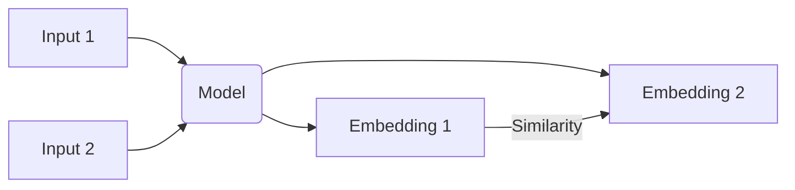
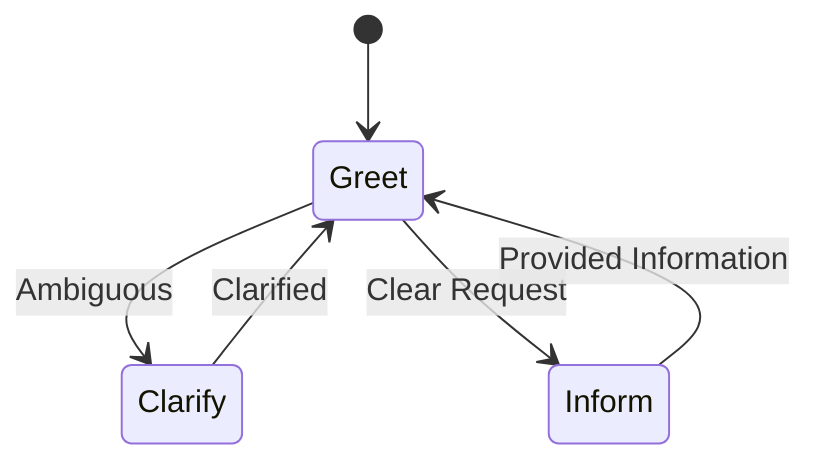
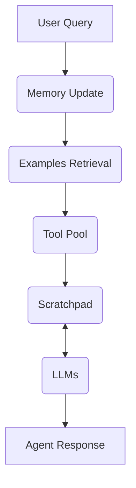
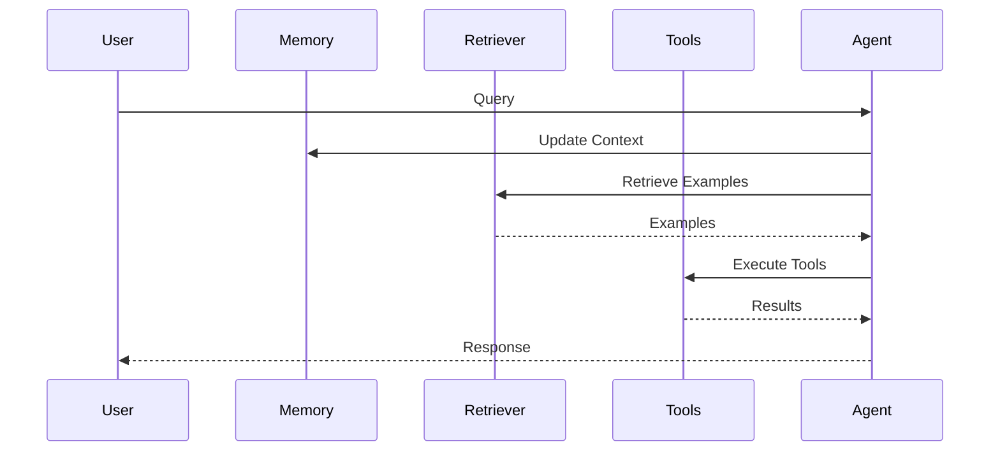

## Further Research

Several areas merit further research to enhance the capabilities of the conversational reservation assistant:

### Embedding Optimization

The current approach uses basic TF-IDF embeddings to index policy documents. More advanced embedding techniques could improve accuracy.

Specifically, exploring transformer models like Sentence BERT that generate contextualized embeddings:

```
f: X → Z 
```

Where f is the embedding function, X is the text input, and Z is the embedding vector space.

Sentence BERT leverages siamese and triplet network structures to derive semantically meaningful representations:



The similarity score provides the training signal. By minimizing distance between positive pairs and maximizing distance between negative pairs, Sentence BERT creates contextual embeddings optimized for semantic search.

Formally, the loss function includes both mean-squared-error (MSE) and cross-entropy (CE) components:

```
L = α*MSE + (1-α)*CE
```

Where α weights the contributions of each term.

By reducing the semantic gap through learned embeddings, retrieval and relevancy can be improved:

```
Accuracy ∝ Similarity(q, d+) - Similarity(q, d-)
```

Where q is the query, d+ is a relevant document, and d- is an irrelevant document. Maximizing this relative difference enhances discrimination.

Some other advanced models to evaluate include Doc2Vec, which extends Word2Vec using paragraph vectors, and Universal Sentence Encoder based on transformer networks.

### Dialog Management

Managing dialog state transitions over long conversations remains an open challenge:



Probabilistic approaches like partially observable Markov decision processes (POMDPs) provide principled mathematical frameworks:

```
P(s'|s,a) - State transition distribution 
P(o|s') - Observation emission distribution
```

By maintaining uncertainty over dialog state s, the model can capture nuances of real-world conversations. Optimization occurs over policy π(a|s) specifying the action a to take in each state s.

RL and deep learning methods can train sophisticated dialog managers end-to-end. Advanced frameworks like Rasa combine neural models with rule-based logic.

### Personalized Recommendation

Incorporating personalization would tailor suggestions to customers:

```
y = f(x1, x2, ..., xn)
```

Where vector x comprises user features to predict recommendation score y. Relevant modalities can encompass demographics, browsed listings, past rental history, etc.

Hybrid filtering approaches leverage both user-item interactions and content data. Latent factor models like matrix factorization are popular techniques:

```
yˆui = μ + bi + bu + qiTp u  
```

Where μ is the global bias, bi and bu capture user/item biases, qi and pu denote latent vectors estimated via gradient descent. Extensions like neural collaborative filtering enhance flexibility.

### Trust and Safety

Safeguarding customer data remains imperative as assistants access sensitive information. Methodologies to explore include:

**Role-based access control (RBAC)**:

```
Permissions = f(Roles, Resources)
```

Where roles map to allowed operations over resources.

**Anomaly detection**:

Identify unusual activities indicating potential issues:

```
Anomaly Score = Distance(x)  
```

Using metric functions over log data x.

Overall, progress in multiple fields – from deep neural networks to reinforcement learning to graph analytics – can enhance the reliability and robustness of conversational agents.

### RAISE Architecture

Recent advancements in large language models (LLMs) like GPT-3 have demonstrated promising capabilities for language generation and understanding. However, effectively integrating LLMs into conversational agents remains an open challenge.

To address this, we propose the **R**easoning **A**nd **I**ntegrated **S**cratchpad **E**nhanced (RAISE) architecture - inspired by the ReAct framework:



The key components include:

**Dual Memory**

- **Scratchpad**: Temporary context during a conversation
- **Examples**: Longer-term relevant dialogues

**Tools**

- **Database Access**
- **Information APIs**
- **Knowledge Bases**

**LLMs**

- GPT-3, GPT-4
- Claude, LaMDA

By integrating a dual memory, RAISE enhances context tracking both short-term and long-term. The tools pool equips the agent with external capabilities to augment its knowledge.

An execution loop leverages all components:



Learnable policies optimize the agent's selection of tools and examples based on dialog state.

By combining strengths of LLMs, external knowledge sources, and structured memory - RAISE aims to advance the scope and interactivity of conversational agents. The modular architecture provides a robust framework for enhancements along multiple dimensions.