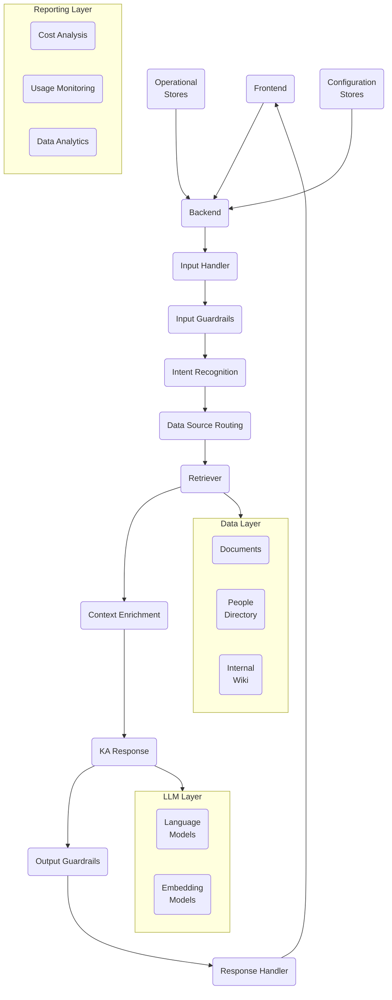

# Architecting an Enterprise-Scale Knowledge Concierge: Considerations for a Secure, Reliable and Cost-Effective System

## Introduction

Knowledge assistants powered by large language models (LLMs) like ChatGPT have tremendous potential to transform enterprises by providing employees 24/7 access to knowledge and expertise. However, scaling these assistants to serve tens of thousands of users in a corporate environment introduces significant technical and operational challenges.

This paper outlines an architecture and key considerations for building an enterprise-grade knowledge assistant that can reliably handle high query volumes while delivering accurate, secure and cost-effective responses.

## Architecture

The proposed knowledge assistant follows a modular Retrieval-Augmented Generation (RAG) architecture segmented into four layers:

### Frontend
The user interface through which employees interact with the assistant. Can be web, mobile or other interfaces.

### Backend
Orchestrates the end-to-end process from receiving user queries to returning responses. Key components include:

- **Input Handler:** Receives queries and loads conversation history and LLM configurations.
- **Input Guardrails:** Validate and transform queries before processing. Includes content filters and query improvement.
- **Intent Recognition:** Categorizes queries into predefined intents to route queries and responses.
- **Data Source Routing:** Maps intents to appropriate data sources like documents, people directory etc.
- **Retriever:** Fetches relevant information from data sources based on the query and intent.
- **Context Enrichment:** Crafts prompts for the LLM by blending instructions, retrieved context and conversation history.
- **KA Response:** Generates a response using the LLM.
- **Output Guardrails:** Post-process LLM's response to filter inappropriate content and detect hallucinations.
- **Response Handler:** Formats the response to return to the user.

### Data Layer
Stores enterprise data that the assistant relies on. Vital for providing relevant, trusted responses. Includes:

- **Documents:** Text content like PDFs, PPTs, Word docs etc. Chunked and embedded for efficient semantic search.
- **People Directory:** Organization personnel details like skills, roles and contacts.
- **Internal Wiki:** Company knowledge base with HR policies, IT guides etc.

### LLM Layer
Provides the language understanding and generation capabilities through LLMs and embedding models.

### Reporting Layer
Enables visibility into usage, costs and analytics to improve and optimize the assistant.

### Operational Stores
Databases that store conversation history, user feedback etc. to provide context for responses.

### Configuration Stores
Glossaries, prompt templates etc. to tune language models and transform user queries.

## Key Considerations

**Prompt Engineering:** Well-designed prompts are critical for guiding LLM behavior and response accuracy. Develop prompts collaboratively with subject matter experts.

**Guardrails:** Input/output guardrails mitigate risks of inappropriate content or hallucinations. Continuously strengthen guardrails to ensure reliability.

**Chunking Strategy:** Impacts performance of semantic search and LLM's understanding. Balance coherence vs conciseness.

**Retrieval Fine-tuning:** Balance quantity, relevance and diversity of retrieved information per intent through user feedback.

**Modularity:** Architect for agility. Ease of swapping LLM vendor, frontend, adding intents & data sources.

**Security:** Access controls, data governance and infrastructure security is paramount, especially when handling sensitive enterprise data.

## Conclusion
Developing a scalable, secure and useful enterprise knowledge assistant requires meticulous attention to architecture, data, model governance and prompt engineering. If executed well, these assistants can be transformational by connecting employees to mission-critical information and expertise 24x7.

The paper outlines considerations for a productionizable architecture that can serve a large enterprise user base reliably and cost-effectively while upholding high standards for accuracy, security and governance.