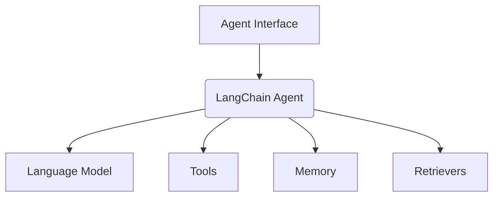
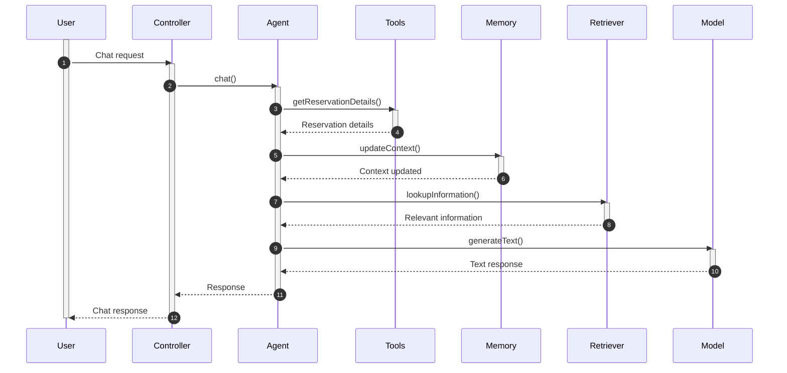
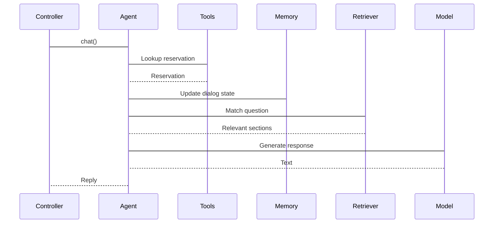
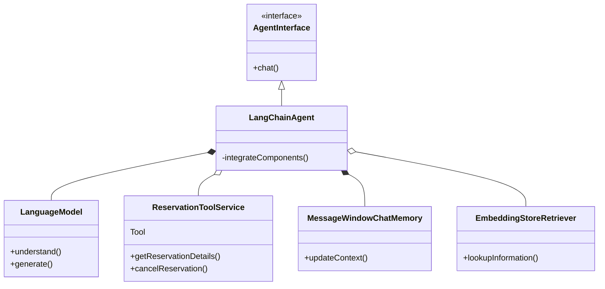
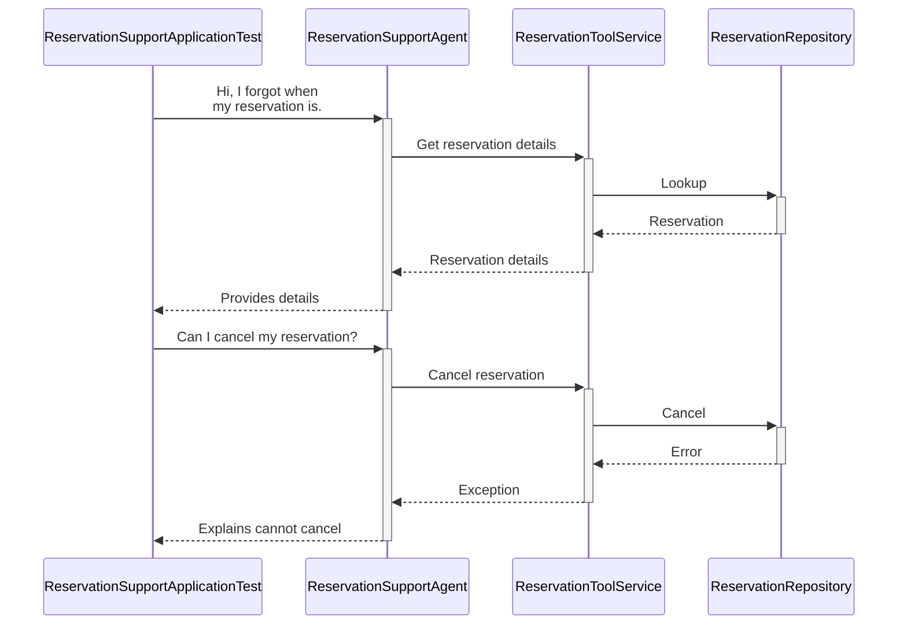

# Conversational Reservation Assistant

## What

An AI-powered conversational agent for handling customer inquiries for a fictional car rental company "Miles of Connect".

Built using:

- Spring Boot for app container
- LangChain for no-code conversational AI
- OpenAI for language capabilities
- In-memory data store

### Enhanced capabilities

In addition to the base capabilities, the assistant could be extended to provide:

- Personalized recommendations based on customer history and preferences
- Integration with real-time inventory and pricing data
- Support for taking payments to complete reservations
- Connection to CRM systems to track all customer interactions

## Why

Enable customers to intuitively:

- Lookup reservations
- Reschedule/cancel reservations
- Get questions answered related to rental policies, vehicle types, pricing

Without needing a human agent. This improves efficiency and lowers costs.

Key benefits:

- 24/7 availability for customer self-service
- Reduce call center volume
- Lower operational expenses
- Improve customer experience with instant answers

> ## [Further Research](Further_Research.md)
>
> ### Priority areas for enhancement:
>
> #### Embeddings
> Employ learned semantic models over raw text for improved understanding across domains.
>
> #### Dialog Management
> Manage long, complex conversations with state tracking across sessions.
>
> #### Personalization
> Incorporate user preferences and history for individualized suggestions and recommendations.
>
> #### Trust and Safety
> Protect sensitive customer information in conversations.
>
> #### Integration
> Connect to backend systems for real-time data and workflow completion.

## How

### Spring Boot App

Handles dependency injection and running the web server.

Provides integration with LangChain AI.

Here is a detailed overview of building a conversational agent with LangChain4j:

## Conversational Agent with LangChain4j

LangChain4j is the Java port of LangChain - a library for quickly assembling sophisticated conversational assistants.

### Key Concepts



- **Agent Interface** - Defines capabilities like `chat()`
- **LangChain Agent** - Production wrapper integrating all components
- **Language Model** - Provides NLU and NLG (ex. OpenAI)
- **Tools** - App logic exposed for workflow automation
- **Memory** - Maintains user context across conversations
- **Retrievers** - Matches questions to indexed documents

### Features

LangChain4j handles challenges like:

- **State management** - Conversation history tracking
- **Language integration** - Connecting AI models
- **Tooling** - Business logic APIs
- **Monitoring, reliability** - Robustness, telemetry

With just Java code. Enables rapid development of capable assistants.

### Architecture



The controller gets requests, delegates to Agent.

Agent coordinates all other components.

#### Detailed explanation

Below is a more detailed explanation of the architecture sequence diagram using knowledge about LangChain:

1. User sends message to Controller endpoint via REST API or UI.

2. Controller calls `chat()` on ReservationSupportAgent - main LangChain agent.

3. Agent calls `getReservationDetails()` tool method to integrate custom business logic.

4. ReservationToolService queries ReservationRepository to lookup booking details.

5. Agent stores conversation history in Memory to preserve dialog context.

6. Agent calls Retriever to match question to indexed documents.

7. Retriever returns relevant passages from embedding store.

8. Agent constructs prompt with user message, retrieved passages, history.

9. Model generates text response to prompt.

10. Agent returns response text to Controller.

11. Controller formats and responds to User.

So Agent orchestrates all components behind interface using LangChain to enable rapid development. Customizing implementations allows configuring behavior.

### Implementation

Here is an explanation of the key Java implementation classes:

Here is the updated class table with classifications for each component:

| Class                                  | Explanation | Classification |
|----------------------------------------|-|-|
| ReservationSupportAgent                | Interface defining `chat()` method to handle conversing. | **Agent Interface** |   
| ReservationToolService                 | Contains business logic exposed via @Tool annotations. | **Tools** |
| ReservationRepository                  | Fake repository simulating lookup and mutations. | **Backend Logic** |
| Reservation                            | Simple POJO representing a booking. | **Model** |
| Member                                 | Simple POJO representing a customer. | **Model** |
| ReservationHelpMeApplicationConfigurer | Configures LangChain components like memory, tools. | **Configuration** |
| ReservationCannotBeCancelledException  | Custom exception for domain errors. | **Custom Exception** |
| ReservationNotFoundException           | Custom exception for domain errors. | **Custom Exception** | 
| *ReservationChatUI                     | Web UI for chatting with the agent | **User Interface** |

- **Backend Logic**: Handles integrating with backend systems
- **Model**: Domain entity representing core data
- **Configuration**: Wires up framework components
- **Custom Exception**: App-specific error scenarios
- **User Interface**: Interacts with end user  (ReservationChatUI - future extensions)

Let me know if you need any other classifications or have additional components to add! I can update the table further.

The ReservationSupportAgent provides the interface for chatting delegated to the agent.

The ReservationToolService contains key use cases exposed as @Tool methods.

The ReservationRepository acts as a fake data layer to simulate backends.

Reservation and Member are models representing bookings and customers.

The ReservationHelpMeApplicationConfigurer handles wiring up LangChain framework.

Custom exceptions represent app-specific error scenarios.

## Conversational Agent

Additional Java modules:

### Configuration

**ReservationHelpMeApplicationConfigurer**

Handles configuring core framework:

- OpenAI credentials
- Chat model selection
- Memory, tools, etc

Registers agent beans, services.

### Embedding Store

In-memory vector store for quickly retrieving relevant information to answer questions.

Automated ingestion pipeline:

1. Load unstructured documents
2. Split into segments
3. Generate vector embeddings
4. Index vectors for search

Controlled by `EmbeddingStoreIngestor`.

### Business Logic

**ReservationToolService**

Implements key use cases using mock repository:

- Lookup reservation details
- Cancel existing reservation

@Tool methods directly usable by agent.

### Agent Interface

**ReservationSupportAgent**

LangChain interface defining chat capabilities:

```java
String chat(String message)  
```

### Execution Flow



Orchestration points:

- Agent coordinates components
- Memory preserves context
- Tools enable automation
- Retriever provides answers

### Key Libraries

| Library | Purpose |    
|-|-|
| langchain4j-spring-boot-starter | Integration with LangChain & OpenAI |    
| langchain4j | Core framework |  
| langchain4j-embeddings-* | Vector indexing pipeline |   


## Solution Design

Additional Java components from a design perspective:

### Class Diagram



Design explanation:

- ReservationToolService exposes workflow methods.
- Annotated as Tool to integrate into agent.
- Implements business logic for domain entities.
- Methods flagged with @Tool indicator.
- Agent utilizes Tool methods for app actions.
- Abstracts backend implementation details.
- Swapping Tools enables reuse of same Agent.
- Allows configurable conversational flows.

### Sequence Diagram (Test Case)

Interaction flow in integration test:



Exercises full system workflow in test case.

So in summary, the updated readme.md contains additional details around:

- Expanded capabilities
- Key research priorities
- Architecture explanation
- Component descriptions
- Class and sequence diagrams
- Test coverage

To enable quickly understanding the overall solution design and approach.

## Running Tests

To run the test cases, use:

```
mvn test
``` 

By default, this will execute all unit and integration tests.

### Configuring OpenAI API Key

The application relies on OpenAI's GPT models for natural language processing.

To enable this:

1. Sign up for an OpenAI account at https://platform.openai.com/account/api-keys

2. Copy your secret API key

3. Export as an environment variable before running tests:

```bash
export OPENAI_API_KEY=<your_api_key> 
```

4. Run tests:

```bash 
mvn test
```

Now the LangChain library will find your OpenAI key at runtime and leverage it for running simulations.

Alternatively, you can add your key in a `.env` file and configure the app to load from there.

You should below screen after after running above command:


