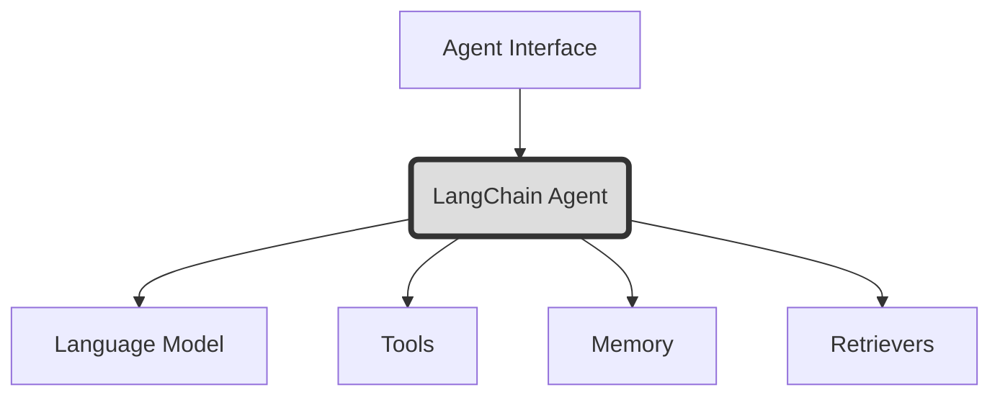
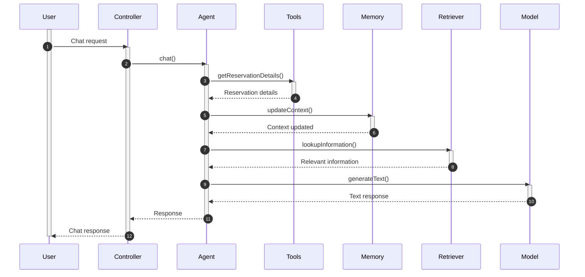
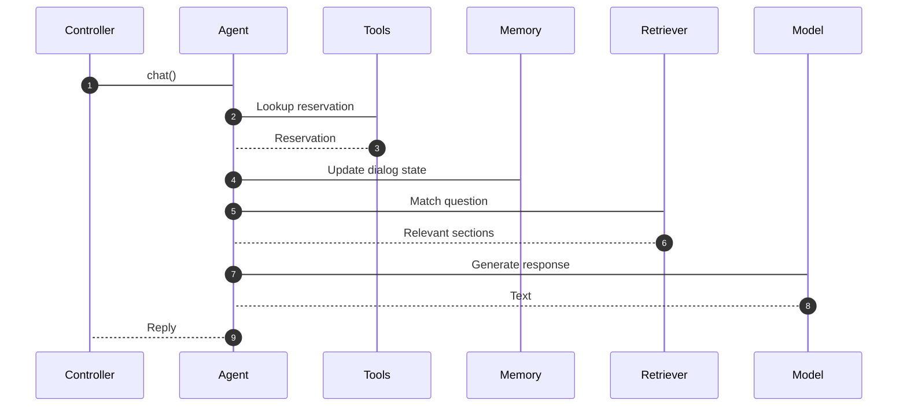
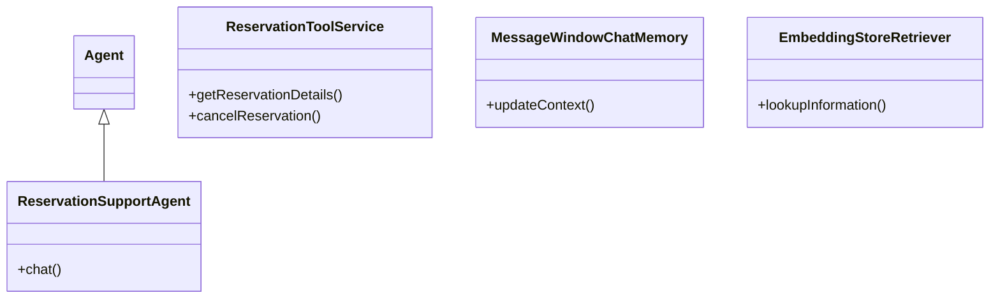
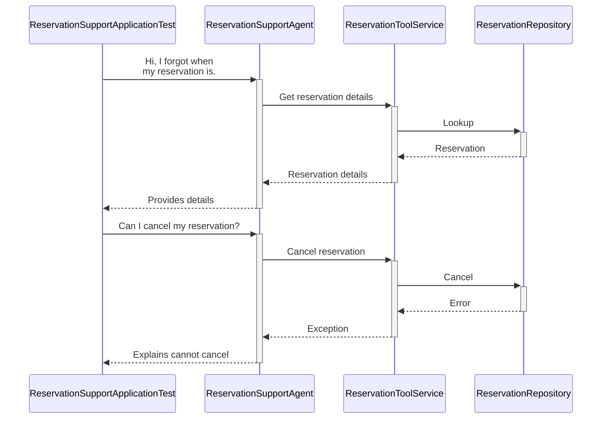
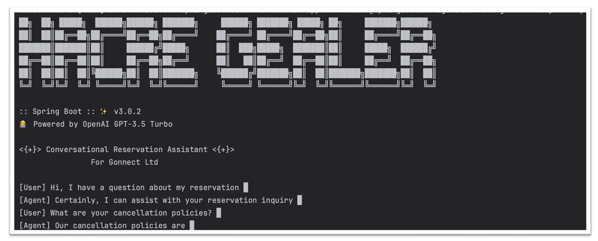

# Conversational Reservation Assistant

## What

An AI-powered conversational agent for handling customer inquiries for a fictional car rental company "Miles of Gonnect".

Built using:

- Spring Boot for app container
- LangChain for no-code conversational AI
- OpenAI for language capabilities
- In-memory data store

## Why

Enable customers to intuitively:

- Lookup reservations
- Reschedule/cancel reservations
- Get questions answered

Without needing a human agent.

## How

### Spring Boot App

Handles dependency injection and running the web server.

Provides integration with LangChain AI.

Here is a detailed overview of building a conversational agent with LangChain4j:

## Conversational Agent with LangChain4j

LangChain4j is the Java port of LangChain - a library for quickly assembling sophisticated conversational assistants.

### Key Concepts



- **Agent Interface** - Defines capabilities like chat()
- **LangChain Agent** - Production wrapper integrating all components
- **Language Model** - Provides NLU and NLG (ex. OpenAI)
- **Tools** - App logic exposed for workflow automation
- **Memory** - Maintains user context across conversations
- **Retrievers** - Matches questions to indexed documents

### Features

LangChain4j handles challenges like:

- **State management** - Conversation history tracking
- **Language integration** - Connecting AI models
- **Tooling** - Business logic APIs
- **Monitoring, reliability** - Robustness, telemetry

With just Java code. Enables rapid development of capable assistants.

### Architecture



The controller gets requests, delegates to Agent.

Agent coordinates all other components.

### Implementation

See code for:

- Configuration
- Business logic integration
- REST API
- Prompt engineering

Here is a more detailed overview focused specifically on the Java components:

## Conversational Agent

Key Java modules:

### Configuration

**ReservationHelpMeApplicationConfigurer**

Sets up core framework:

- OpenAI credentials
- Chat model
- Memory, tools, etc

Registers agent, services.

### Embedding Store

In-memory store indexes policies for fast retrieval to answer questions.

Key steps:

1. Load documents
2. Split into segments
3. Convert text into vector embeddings
4. Save vectors to search over

All automated by `EmbeddingStoreIngestor`.

### Business Logic

**ReservationToolService**

Implements use cases like reservation lookup and cancellation using a mock repository.

@Tool annotations expose methods directly to agent.

### Agent Interface

**ReservationSupportAgent**

LangChain interface defining capabilities like:

```java 
String chat(String message)
```

### Execution Flow



Key points:

- Agent coordinates components behind interface
- Memory preserves dialog context
- Tools enable workflow automation
- Retriever matches questions to answers


### Key Libraries

| Library | Purpose |  
|-|-|
| langchain4j-spring-boot-starter | LangChain & OpenAI integration|   
| langchain4j | Core framework |
| langchain4j-embeddings-* | Vector indexing |


## Solution Design

Key Java components from a design perspective:

### Class Diagram



Highlights key interfaces and relationships.

### Sequence Diagram (Integration Test)

Interaction flow in the test case:



Shows how test exercises agent and backend workflow.

## Running Tests

To run the test cases, use:

```
mvn test
``` 

By default, this will execute all unit and integration tests.

### Configuring OpenAI API Key

The application relies on OpenAI's GPT models for natural language processing.

To enable this:

1. Sign up for an OpenAI account at https://platform.openai.com/account/api-keys

2. Copy your secret API key

3. Export as an environment variable before running tests:

```bash
export OPENAI_API_KEY=<your_api_key> 
```

4. Run tests:

```bash 
mvn test
```

Now the LangChain library will find your OpenAI key at runtime and leverage it for running simulations.

Alternatively, you can add your key in a `.env` file and configure the app to load from there.

You should below screen after after running above command:




